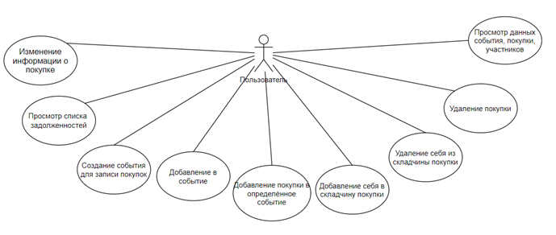
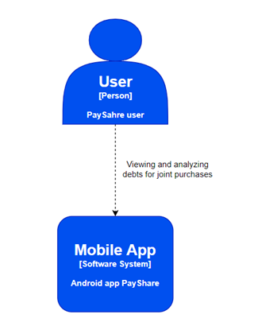
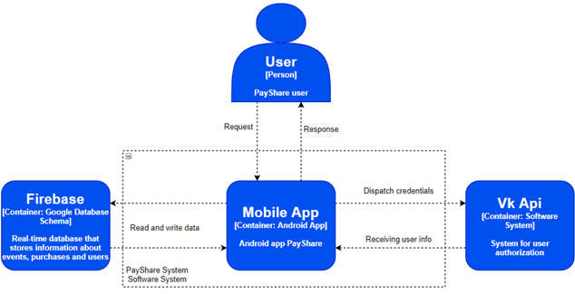

# ShoppingCalculator

Группа: 3530904/80103                                                      

Выполнили: 
  * Бубляев А.В.
  * Толстиков Г.Н.
  * Афанасьев А.А.
  * Богданов Д.А.

<a href=https://github.com/whoopzee9/ShoppingCalculator/blob/main/3530904_80103_Report.pdf>Отчет</a>

# **Оглавление**

1. Определение проблемы

2. Выработка требований

3. Проектирование и разработка архитектуры

4. Кодирование и отладка

5. Тестирование

6. Сборка

# Определение проблемы 

Задача состоит в разработке проекта Android приложения, которое помогает правильно разделять расходы после совместных покупок.

Наш проект позволяет пользователям загружать информацию о своих совместных или одиночных покупках, а потом видеть свои задолженности другим пользователям.

# Выработка требований

**_Диаграмма UML - Моделирование использования_**

#

# Проектирование и разработка архитектуры

**_System Context diagram_**

**_Container diagram_**

# Кодирование и отладка

Проект написан на языке программирования Kotlin в среде разработки Android Studio, управление и сборка осуществляются с помощью инструмента Gradle.

Установочные файлы apk располагаются по следующему пути:

_`ShoppingCalculator\apk\payShare.apk`_

_`ShoppingCalculator\app\release\app-release.apk`_

# Тестирование

Был выполнен ряд тестов, написанных с помощью фреймворка автоматического тестирования JUnit.

Также мы успешно провели автоматизированное тестрирование на Firebase Test Lab. 

# Сборка и запуск тестов

Сборка и запуск происходят при помощи следующих скриптов, которые заменяют gradle:

1. _`gradlew app:android`_
2. _`gradlew app:build`_
3. _`gradlew app:test`_
